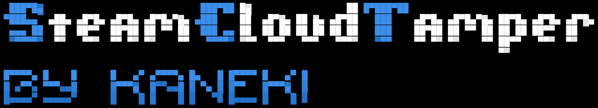

# 

Runs your steam cloud saves though a car wash. Not sure it improved anything, but they
sure are clean now. And parked. Parked saves! Because Valve told us "you cant upload to
games you dont own anymore" (around april 2025) and we went "fine, we'll keep em in
buckets you technically cant argue with".

pronounced **SCT** like you'd say "sick" if you stubbed your toe.

## 🌸 special thanks: ace (∞/∞, would proxy again) 🌸

```
         +-------------------------------------------+
         |             <3  A C E  <3                 |
         |         github.com/AceSLS                 |
         |                                           |
         |  dev rating  : infinity/infinity          |
         |  patience    : >= a saint                 |
         |  helpfulness : 11/10, off the charts      |
         +-------------------------------------------+
              /( ^ x ^ )\  thank you!!  /( ^ x ^ )\
```

(◕‿◕) the appid proxy trick - the one that lets unowned games ride an owned bucket
under cute little `sls-<game>/` prefixes - was **her** idea first. she wrote the
original patch ([docs/APPID-PROXY.md](docs/APPID-PROXY.md) is basically a love letter to it),
and then sat through a bazillion questions while we ported it into SCT without the
hook. changelist filtering? she knew. the cloud-cleaner forward-iteration bug? she
knew. "iterate backwards fyi" - yes ma'am, we do it backwards now, promise. (つ≧▽≦)つ

she helped a lot. we would rate her dev skills infinity/infinity. if this readme
could blush it would 🥰 ⋆｡°✩ 🎀

- [github.com/AceSLS](https://github.com/AceSLS) — go say hi, tell her SCT says thanks.

## the short version

- Steam descided to refuse cloud uploads for games your account does not own. server
  side. no warning, no "are you sure".
- steamtools did the 760 thing and now everyones userdata has mystery files in the
  screenshots bucket. we also did NOT do that, stop asking.
- this tool finds those buckets, probes what valve still lets you do with them, wipes
  the ones it can, and **parks** saves you care about into appid containers you DO own
  (hidden dev apps, tools, free games, your own library buckets - see "smart appid
  containers" below).
- parked files carry a barcode trailer so they never become anonymous junk. this is the
  "barcode lane". do not ask why its called a barcode, we though it looked cool.

## why it exists (the rant)

Before ~april 2025 you could upload a save file into any appid bucket. People
(steamtools, u know who u are) dumped EVERYTHING into 760 - the screenshots app - so
saves from 20 different games collided into one folder. valve noticed. valve patched
it. now even *enumerating* an unowned bucket gives you `AccessDenied` (we tested,
logged in, still denied - thanks valve).

so the old "just upload it into 760 nobody will notice lmao" era is over. what still
works, because steel engine is dumb:

- you own spacewar (480). everyone owns spacewar. its a hidden test game. buckets for
  hidden/apps/tools are totally normal.
- steam client config bucket (7) actually syncs to real UFS on this machine - we
  litterally watched `Successfully synced to ChangeNumber'65'` happen in cloud_log.
- free games, mod hosts, steamvr stuff - all entitled to every account.

so instead of **flooding**, which is what got the whole thing locked down, SCT does the
opposite: one small private file, one real app bucket, spread & mirrored, with a
trailer that tells you wtf it is. anti-ban is the whole point. dont ruin it.

## project layout

- `src/SteamCloudTamper.Core` - models, vdf parser/writer + remotecache generator, root-path map, steam
  install/account discovery, config, and the parking brain (PoolDb + registry + allocator + discoverer)
- `src/SteamCloudTamper.Engines` - SteamSession (anon / creds+guard / QR), CloudRpcClient (the actual cloud
  RPCs), AuditEngine, WipeEngine, LocalInjectEngine (lock/relocate), CloudLogWatcher (the verdict reader)
- `src/SteamCloudTamper.Cli` - command line face. good old `cmd`, no sparkles.
- `src/SteamCloudTamper.Tui` - the pretty face. Spectre.Console, gradients, glow, a sine wave, QR
  rendering in the terminal. yes we know the glow is excessive. no we wont remove it. `SCT_TUI_FLAT=1`
  if you hate fun.
- `src/SteamCloudTamper` - the one exe that figures out which face you want (no args + console = TUI,
  flags = CLI). `tools/publish.ps1` builds the self-contained single file into `dist/`.
- `tools/steamcloudsave` - `SteamCloudSave.dll`, a steam_api64 shim / shadow lane for games that should
  never touch your real cloud. mounts: shim, gbe `load_dlls`, OST `[inject]`.
- `integrations/opensteamtool` - OST toml snippet, lua pool snippet, the "make the gui show synced" writeup.
- `tests/SteamCloudTamper.Core.Tests` - xunit. 30 passing. the ones that ssh into steam are the fun ones.

## commands

```
detect                  find steam + accounts + libraries (it printed something, use it)
scan                    audit local userdata buckets (per account/app) + barcode tags
remote-list --app <id>  list files in a cloud bucket (may just say AccessDenied, embrace it)
probe <appid...>        check what the backend allows: enumerate / upload / delete
wipe <appid> <file> [--blank] [--force]      delete or blank one cloud file
wipe-all <appid> [--blank] [--force]         wipe a whole bucket
guards add|rm|ls <appid>   never-touch list (persisted, so you dont nuke your own saves by accident)
inject <uid3> <appid> <file> [remote-name]   local user drop + remotecache.vdf regen
lock/unlock <uid3> <appid>                    read-only file blocks steam re-creating the folder
relocate/unrelocate <uid3> <appid>            junction-isolate bucket into the SCT stash

parking brain (anti-ban: private saves, real apps, never public flooding):
    pool list | refresh        the curated slot pool (owned-game buckets NEVER picked by default)
    pool discover [--net]      sweep the machine for container appids: pool + userdata buckets +
                               OST lua addappid hooks + CloudRedirect host + SLS/GreenLuma configs.
                               each container gets kind/source/posture + AutoClouded flag, snapshot
                               lands in the registry. --net also reads cloud_log for the AutoCloud part.
    pool probe [--uid <id3>] [--force] [--wait-sec N]
                               one private file, let the RUNNING steam client sync it, read the verdict
                               from cloud_log. verdicts go to the registry. nobody logs in. its neat.
    park <gameAppId> [--uid <id3>] [--force] [--lane auto|client|rpc|stage] [--bucket <appid>]
         [--spread N] [--copies N] [--stealth] [--wait-sec N]
                               auto   = steam up + right account -> client lane; else rpc
                               client = stage local, the signed-in session does the upload
                                        (real UFS or the CR provider, live postures tell us where)
rpc    = SCT logs in itself (env creds or QR) and uploads directly.
                                         the ONLY real upload for buckets the client never
                                         AutoClouds itself (lookin at you, 480)
                                stage  = files local only, the session syncs whenever it feels like it
                                --bucket pins all files to ONE explicit slot (refuses blocked/denied ones)
                                --proxy <appid> ride an OWNED bucket instead of the pool: unowned saves
                                         get parked under a sls-<game>/ namespace inside your own bucket
                                         (a la Ace SLS, no client hook needed - see APPID-PROXY.md).
                                         rpc-only. auto-resolves from the CloudProxies map.
    proxy status | set <game> <proxy> | rm <game> | ls
                                the appid-proxy map: game -> owned bucket. game 0 = default for
                                EVERY unowned game without its own entry. lives in the config.
    client status | sync <appid> [--down] | tell <command>
                               client lane: status / force a sync tick / raw console cmd.
                               (the steam console is blocked on modern client builds - we checked,
                               like, three times - so sync rides the AutoCloud tick instead)
    provider status | init [sync-dir] | ls [--uid <id3>] [--app <appid>]
                               CloudRedirect folder-provider management (SCT writes the config)
    unpark <storageAppId> <name> [outdir]    download + strip barcode, original bytes back
    rebuild                   tail-scan userdata -> registry.json (1000 files < 1s, ur welcome)
    barcode <file> | barcode make <payload>  show/render barcode trailers

web lane (needs SCT_COOKIE):   web ls | files <appid> | dl <appid> <file> [outfile]
ferry (park into owned 480 / spacewar):  ferry ls | upload <local-file> [name] | dl <name> [outfile]
```

the whole thing ships as ONE exe: `dist\SteamCloudTamper.exe` (self-contained, no .net needed,
doubleclick = TUI - cmd flags = CLI). running from source needs the net10 sdk which on this
machine lives at `C:\Users\kaneki\dotnet10` (yes its not on PATH, no we dont know why either).

## the barcode lane (why parking isnt just dumping files)

parked saves get a trailer glued to their ass: `SCTB1` magic + crc32 + payload

```
<original-game-appid>|<steam-userid3>|<DDMMYYYY>     e.g. 588650|1201110076|09082026
```

- the storage appid is NEVER in the payload - the bucket you are sitting in **is** the storage.
- fresh pc, no registry, no problem: `rebuild` reads the last 4KB of every file and reconstructs
  the whole map. we wrote it so it doesnt even try on files smaller than the window. ur welcome.
- unparking strips the trailer. byte identical. promise (there is a crc32 so even a lie would be a
  verifiable lie).
- every lane reads/writes the same `%LOCALAPPDATA%\SCT\registry.json`.

## parking allocator rules (in order)

1. hidden/dev apps, valve tools, mod hosts > old free games. owned-game buckets are tier 3 and marked
   "NEVER" until the user explicitly says otherwise (there is no "otherwise" yet. soon:tm:).
2. anti-ban: server-`Denied` slots (from pool probe) are skipped. `--spread` fans files out.
   `--copies` duplicates so one purged bucket cant nuke your whole save. `--stealth` hashes names
   so they look native (the trailer still knows).
3. co-tanency wins - a bucket already holding other parked games is preferred.
4. name collision or quota -> next candidate. deterministic. boring. safe.

## riding the running steam session (no sct login, mostly)

`SteamLocator` figures out who's signed in via `config/loginusers.vdf` (active -> autologin ->
most recent, the normal pecking order). when that account is live:

- `park` and `pool probe` default to the **client lane**: stage files, let real steam upload,
  read the verdict from `logs/cloud_log.txt` (`Upload complete, result OK` / `Access Denied`).
- **AutoCloud reality check (2026-08-10, watched this machine burn)** - steam only AutoClouds
  buckets it manages *itself*. here that's appid 7 (real UFS, change number 65), 588650 (now
  CloudRedirect-local), and the actually installed games. **480 and 113200 are NEVER
  AutoClouded** - a staged file there just sits there. verdict stays "Unknown" and we tell you
  straight. real upload into 480 requires `--lane rpc`.
- **posture tracking** - every slot records where the upload actually landed: `real` (valve),
  `provider` (CloudRedirect folder), `redirected` (ost lua hook - never touched valve), `local`
  (staged, unconfirmed). the registry screen shows it live.
- **steam console: dead on arrival** - `steam://open/console` doesnt open on current client
  builds (checked with `-console`, checked without, checked angry). SCT skips it, waits on the
  autocloud tick, and the deterministic real-upload lane is rpc. sorry, youtube 2019 videos.

## "sync'd" in the steam GUI (OST + CloudRedirect, verified 2026-08-10)

for unowned games (dead cells 588650 etc) the client kept crying "cloud sync error". fix, proven
end to end: OpenSteamTool built from main (v1.4.8 release predates the `[cloud]` host) +
CloudRedirect v2.6.4 + `[cloud] enabled=true` in `opensteamtool.toml`, provider folder
`D:\sct_provider`. cloud_log goes from `Access Denied` to `HTTP upload ... success` ->
`Upload complete, result OK`, gui shows the cloud icon, everyone claps. details in
`integrations/opensteamtool/OST-HOST-BUILD.md`.

## smart appid containers (the "switching" thing)

`pool discover` builds the whole universe of appids SCT may park into, saves it to the registry:

- pool slots (spacewar, steam client 7, steamvr suite, free games, mod hosts)
- real userdata buckets (games in the lib)
- ost lua `addappid` hooks (`config/lua/*.lua`) - these never touch valve, posture says so
- the cloudredirect host marker when `[cloud]` is on
- sls/goldberg `steam_settings/appid.txt` + greenluma `appidwhitelist.txt` (auto-probed, absent = skipped)
- each container: kind (owned/free/hidden/modhost/activation), source, posture, AutoClouded? and
  the client's own cloud_log is consulted with `--net`

posture decides how much a container is "worth": redirected ones are disfavored for the rpc
lane, real valve-touching ones are the good stuff. owned buckets show up but are never picked
without consent. the TUI has the same view (Registry -> "Show discovered containers").

> actually proven on this machine: 41 containers. 5 lua hooks, 1 CR host marker, rest pool+real.
> yes we count these things. its a hobby.

## wipe reality check

valve denies uploads to unowned games, server side, since ~april 2025, and even enumeration is
denied. so wiping is a three-step dance:

1. `remote-list --app <id>` - does the bucket even exist / what's in it
2. `probe <id>` - what does your account get to do: enumerate / upload / delete
3. `wipe <id> <file>` - try delete, then blank-overwrite, accept the result

stuff valve wont remove gets the local treatment instead (below). some things are just
permanent. like that one save from 2013. it hears you. it remembers.

## local isolation (for locked / unremovable buckets)

1. **CloudRedirect nullify** - point the redirect at an empty private folder instead of the real
   userdata, game never sees steam's copy again. (CR itself lives outside this repo - we do the
   server api + local files.)
2. **lockfile blocker (`lock`)** - windows refuses to create a folder where a file with that name
   exists. so we delete the folder (with `--force`, after a backup) and plant a read-only file
   named after it. steam fails sync re-creation silently. `unlock` cleans up. yes, this is kind
   of rude. no we dont care.
4. **junction isolation (`relocate`)** - move the bucket into `%LOCALAPPDATA%\SCT\stash` and leave
   a junction. steam reads/writes through the junction without knowing. `unrelocate` reverses.
5. **hook lane (`SteamCloudSave.dll`)** - steam_api64 shim / `load_dlls` / OST `[inject]`:
   `steamcloudsave.cfg` flags the game, all its ISteamRemoteStorage calls get shadowed under
   `D:\sct_shadow\<appid>\`. the game can't see your real cloud. some games get mad about this.
   those are called "unlocks". (the GUI "synced" path for those is OST `[cloud]` + CloudRedirect.)
3. **console tricks** - `steam://open/console` does NOT do what the 2019 writeups claim. verified
   on 2026-08-10, the console doesnt even open anymore. the real per-app client switches are:
   settings > cloud toggles (owned apps), the lockfile, or cloudredirect hiding. sorry.

## research notes (why this whole mess exists)

- **760 pollution, confirmed by multiple RE projects**: steamtools rewrote cloud requests for
  unowned games into appid 760 without per-game prefixes, so saves collided across games and got
  mirrored into every injected app's userdata. STFixer, cloudredirect and this repo all started
  with the same bruised knuckles.
- **valve patch april 2025**: cloud UFS for unowned appids -> `AccessDenied` on
  enumerate/upload/delete. confirmed even logged in.
- **retail SteamCloudFileManager**: even they get physically rejected for special internal
  appids (760/7) server side, so they resort to CDP-hijacked web sessions. our web lane is
  read-only by design - same wall, less credit card drama.
- **old conflict-dialog trick** (zero files, delete remotecache, "upload nothing"): predates the
  2025 patch and only really works for owned games now. like mail order. fine in its day.
- **active lanes for stuck unowned buckets**: web (read/backup), ferry (480/hidden), barcode
  park (allocator, spread/copies/stealth), client lane (staged via running session), local
  lockout/junction, hook shim, cloudredirect via OST `[cloud]`, and steam support tickets (may
  god have mercy on your soul).
- **no flooding. ever.** every probe/park write is one small private file in a real app's
  bucket. the 760 mass-dump is EXACTLY what got UFS locked down. SCT does the opposite on
  purpose and the pool probe is there to keep it that way.

## known broken / wontfix

- steam console: blocked on this client build, forever onwards. lane is tick-based.
- 480 / 113200: never autoclouded by the client. rpc lane or bust (and rpc needs a real session -
  anonymous uploads are denied even for spacewar. valve said so. we screamed).
- no credentials ship with the program. SCT_USER/SCT_PASS or scan a QR in the TUI. reasonably
  sure you prefer "scan a qr" over "send us your password in a txt".

## build

```
powershell -ExecutionPolicy Bypass -File tools\publish.ps1      # -> dist\SteamCloudTamper.exe
dotnet test tests\SteamCloudTamper.Core.Tests                    # 30 passing, usually
```

tui extras: `SCT_TUI_ASCII=1` // `SCT_TUI_NERD=1` // `SCT_TUI_FLAT=1` if you hate gradients.
crash log (it never happens, but if it does): `%LOCALAPPDATA%\SCT\tui-crash.log`
